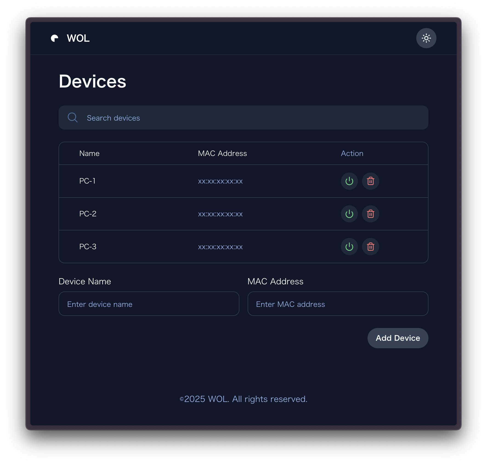

# Wake on LAN WebUI


Wake on Lanマジックパケットをブラウザ上で送信することが出来るwebアプリです。  
バックエンドはGo、フロントエンドはNext.js(SSG)で構成しています。
## 環境構築

### 動作確認環境
Ubuntu 22.04 LTS  
### 必要なソフト
- Docker  
- Docker Compose

### インストールと起動
```
# リポジトリのクローン
git clone https://github.com/kusupon/Wake-on-LAN-WebUI.git
cd Wake-on-LAN-WebUI

# コンテナの起動
docker compose up -d --build
```
起動後、以下のURLからWeb UIにアクセス出来ます。  
`http://<サーバーのIP>:3005`  

外出先からアクセスする場合はTailscale等を使用してください

## ポート設定

APIサーバー: `8008`  
Web UI: `3005`
## API
- ### デバイスリスト取得
  `GET /api/devices/`
- ### デバイス追加
  `POST /api/devices/`    
  ```
  {
    "name": "デバイス名",
    "macAddress": "MAC アドレス"
  }
  ```
- ### デバイス削除
  `DELETE /api/devices/[deviceName]`   


- ### Wake on LAN
  `POST /api/devices/[deviceName]/wake`  

## devices.json
デバイス情報(端末名とMacアドレス)を保管します。
コンテナ初回起動時に自動生成されます。
```
[
  {
    "name": "PC-1",
    "macAddress": "xx:xx:xx:xx:xx:xx"
  },
  {
    "name": "PC-2",
    "macAddress": "xx:xx:xx:xx:xx:xx"
  }
]
```
