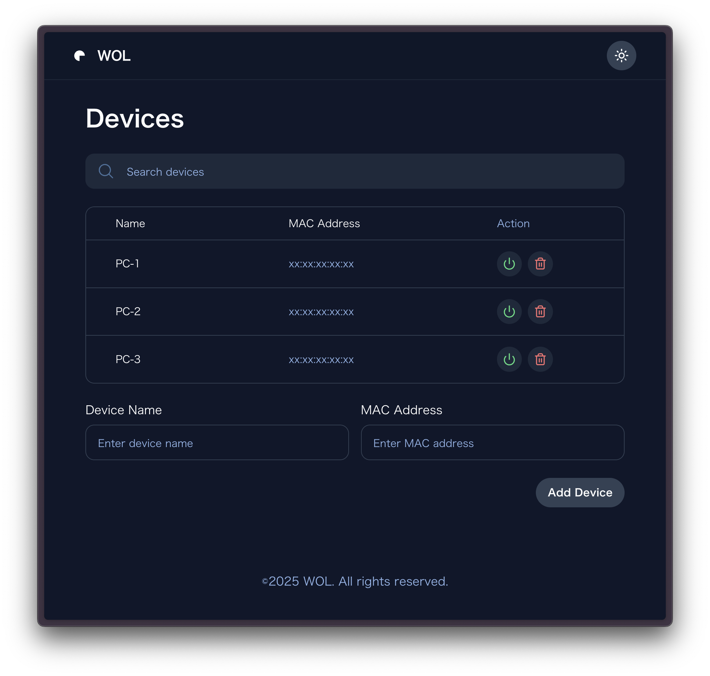

# Wake on LAN WebUI

ブラウザから気軽にWOLすることが出来るwebアプリです

## 環境構築
⚠️自宅にあるサーバーやラズパイ等にホスティングすることを想定しています

Node.jsとPM2が必要です
```
# リポジトリのクローン
$ git clone https://github.com/kusupon/Wake-on-LAN-WebUI.git
$ cd Wake-on-LAN-WebUI

# インストールとビルド
$ npm install
$ npm run build

# サーバー起動
$ pm2 start npm --name "wol-webui" -- start
```
http://(サーバーのip):3005 でアクセス出来ます。

外出先からアクセスする場合はTailscale等を使用してください

## API
- ### デバイスリスト取得
  エンドポイント: `/api/devices/list`  
  メソッド: `GET`
- ### デバイス追加
  エンドポイント: `/api/devices/add`  
  メソッド: `POST`  
  ```
  {
    "name": "デバイス名",
    "macAddress": "MAC アドレス"
  }
  ```
- ### デバイス削除
  エンドポイント: `/api/devices/delete/[deviceName]`  
  メソッド: `DELETE`  


- ### Wake on LAN
  エンドポイント:`/api/wake`  
  メソッド: `POST`  
  ```
  { 
    "deviceName": "デバイス名"
  }
  ```

## devices.json
```
[
  {
    "name": "PC-1", 
    "macAddress": "xx:xx:xx:xx:xx:xx"
  },
  {
    "name": "PC-2",
    "macAddress": "xx:xx:xx:xx:xx:xx"
  }
]
```